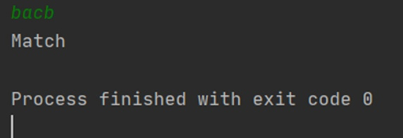
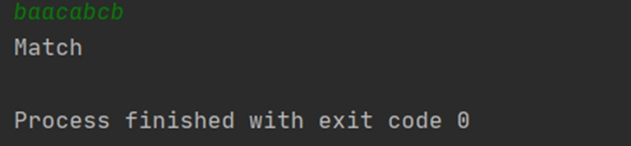
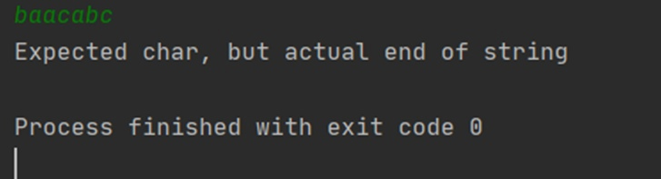
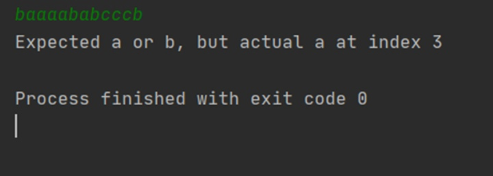

# Task

Construction of Nondeterministic finite automaton by regex:

Constructio Deterministic finite automaton by Nondeterministic finite automaton

Minimize Deterministic finite automaton

Write the programm

### RESULT of Programm 

