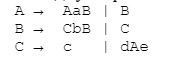
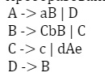
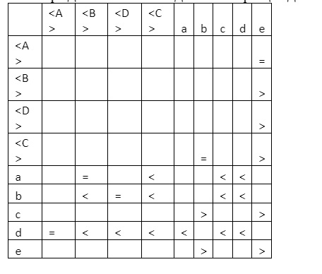
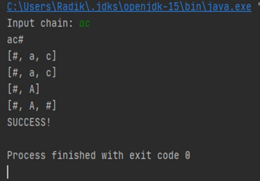
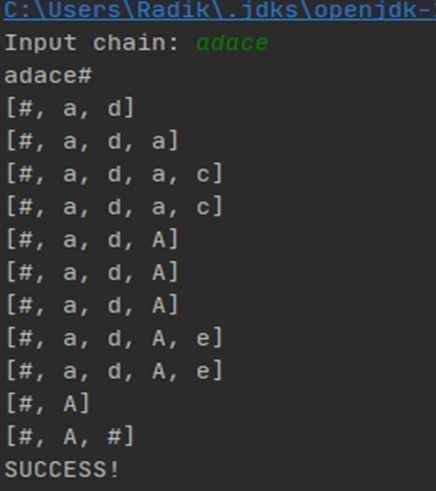
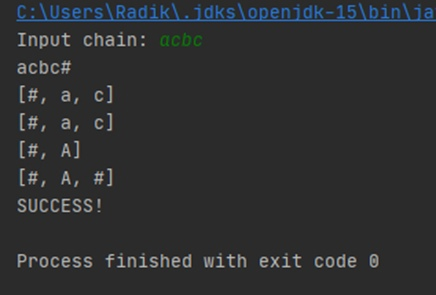
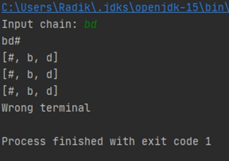
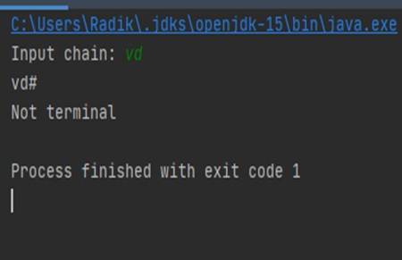
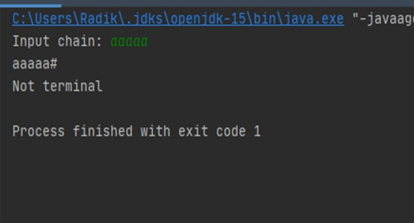

# TASK: Designing a Recognizer for Context-Free Grammars of Simple Precedence

### Original Grammar

### Converted Grammar

### Matrix for Converted Grammar

### [Software implementation of the recognizer](src/main/java/Main.java) 

### Result of programm

