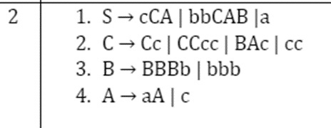

# TASK: Construction of a recognizer for Context-Free grammar by the method of recursive descent

### Original Grammar

### [Software implementation after elimination initial recursion, carrying out the left factorization and right convertation of the graammar](main.cpp) 
