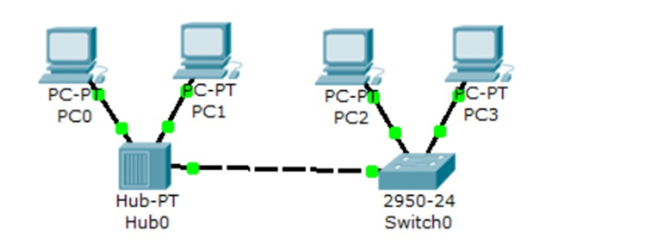
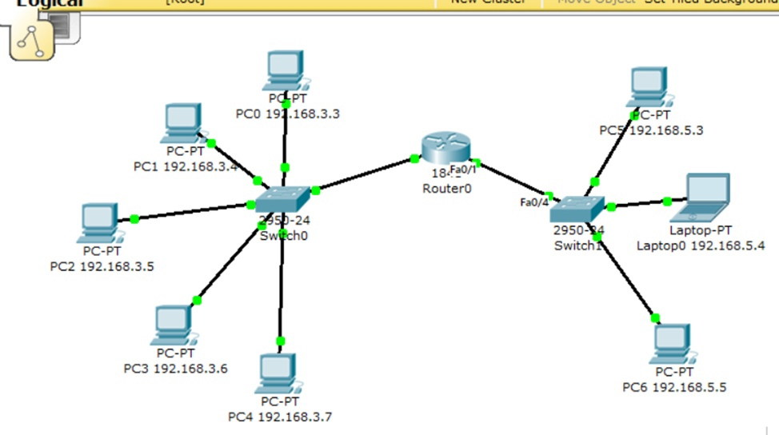
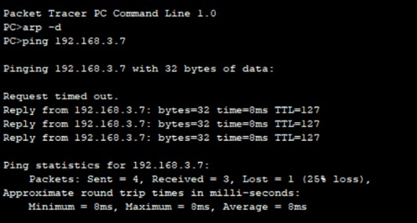
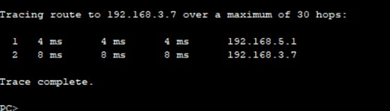
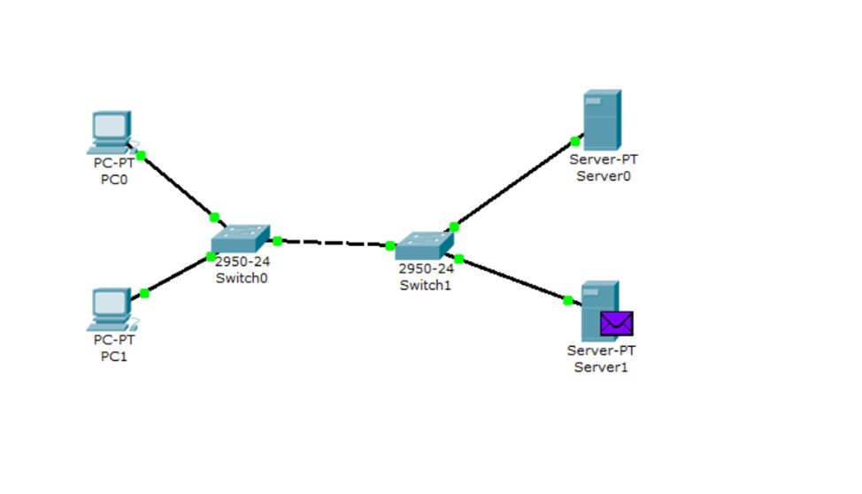
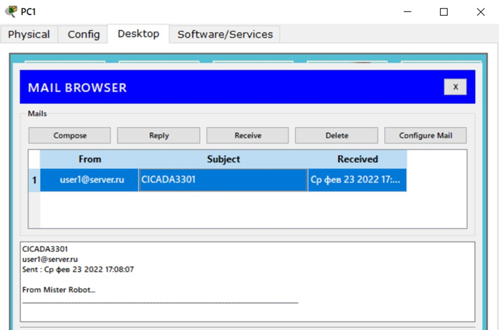

# Network tasks

### First task: [Cisco packet tracer - First topology](First_Lab.pkt)

###### Topology

### Second task: [Cisco packet tracer - ARP and ICMP](Second_lab.pkt)

###### Topology

###### Ping

###### Trace route

### Third task: [Cisco packet tracer - SMTP and POP3](Third_Lab.pkt)

###### Topology

###### Result

### Fourth task: [Packet sniffing in Wireshark](Shubarov%20P33212%20Lab_4.docx)
