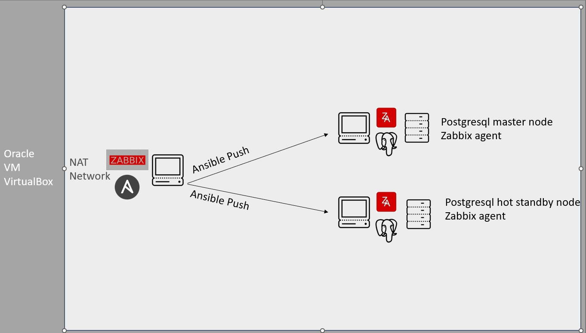

# Infrastructure as a Code

### Schema

Nodes OS: Ubuntu 20.04

### Description
Install Ansible, Nginx and Zabbix on Master Mode

Zabbix web uplift

Forwarding ssh keys to servers

Install postgresql and zabbix agent on database servers using [Ansible playbooks](Ansible-Playbooks)

